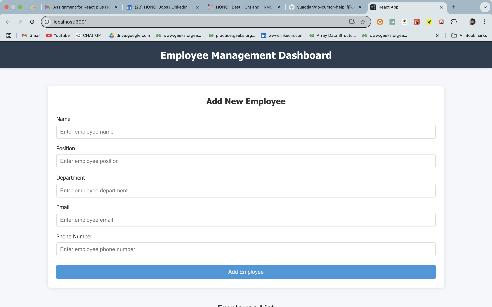
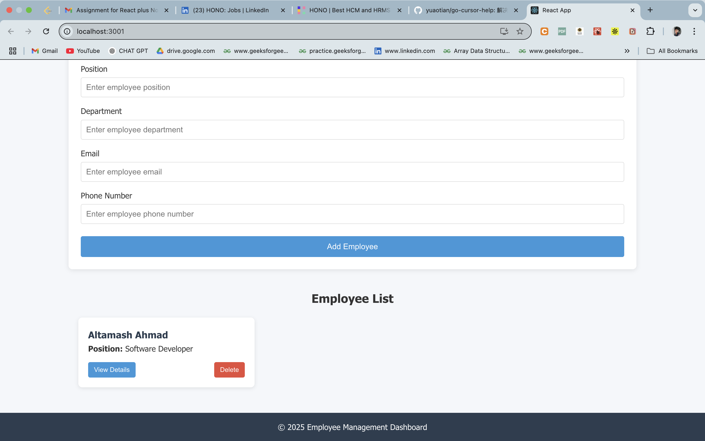

# Employee Management Dashboard

A simple Employee Management Dashboard with features to view, add, edit, and delete employee records.

## Features

- View a list of all employees with their names and positions
- View detailed information for each employee in a modal
- Add new employees with form validation
- Edit existing employee details
- Delete employees with confirmation
- Responsive design for various screen sizes

## Tech Stack

- **Frontend**: 
  - React.js with functional components and hooks
  - CSS for styling (organized in a dedicated styles directory)
  - Axios for API requests

- **Backend**: 
  - Node.js with Express
  - RESTful API architecture
  - CORS for cross-origin requests

- **Database**: 
  - In-memory JSON file storage
  - File system operations for persistence

## Project Structure

```
employee-management-dashboard/
├── backend/                 # Backend server code
│   ├── data/                # JSON data storage
│   ├── index.js             # Express server setup
│   └── package.json         # Backend dependencies
│
└── frontend/                # React frontend code
    ├── public/              # Static files
    └── src/                 # Source code
        ├── components/      # React components
        ├── services/        # API services
        ├── styles/          # CSS files
        ├── App.js           # Main App component
        └── index.js         # Entry point
```

## Setup Instructions

### Prerequisites

- Node.js (v14 or higher)
- npm (v6 or higher)

### Installation

1. Clone the repository:
   ```
   git clone <repository-url>
   cd employee-management-dashboard
   ```

2. Install backend dependencies:
   ```
   cd backend
   npm install
   ```

3. Install frontend dependencies:
   ```
   cd ../frontend
   npm install
   ```

### Running the Application

1. Start the backend server:
   ```
   cd backend
   npm run dev
   ```
   The server will run on http://localhost:5001

2. In a new terminal, start the frontend development server:
   ```
   cd frontend
   npm start
   ```
   The React app will run on http://localhost:3001

3. Open your browser and navigate to http://localhost:3001 to use the application

## API Endpoints

- `GET /employees` - Get all employees
- `GET /employees/:id` - Get a specific employee by ID
- `POST /employees` - Add a new employee
- `PUT /employees/:id` - Update an employee
- `DELETE /employees/:id` - Delete an employee

## Application Workflow

1. **View Employees**: The main page displays a list of all employees with their names and positions
2. **Add Employees**: Fill out the form at the top to add new employees
3. **View Details**: Click "View Details" on any employee card to see all their information
4. **Edit Employees**: In the details modal, click "Edit" to modify employee information
5. **Delete Employees**: Click "Delete" on any employee card to remove them

## Form Validation

The application includes validation for all form fields:
- Name, Position, Department, Email, and Phone are required fields
- Email must be in a valid format
- Error messages are displayed for invalid inputs

## Screenshots

### Main Dashboard

*The main dashboard showing the "Add New Employee" form and the list of employees*

### Employee List

*The employee list showing employee cards with name, position, and action buttons*


